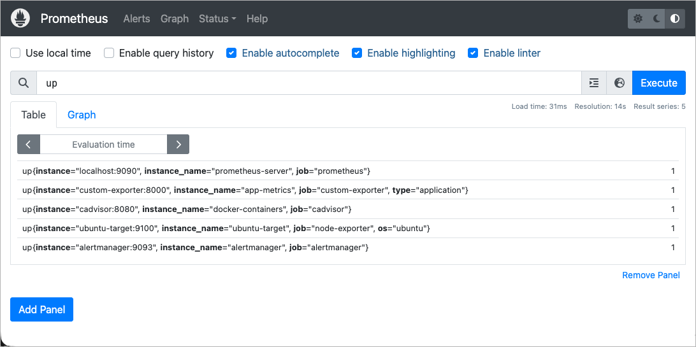

# Step 02: Prometheus 기초 및 UI

## 📌 이 단계에서 배우는 것
- Prometheus의 핵심 개념
- 메트릭 데이터 모델 (메트릭명, 레이블, 타임스탬프)
- 메트릭 타입 4가지
- Prometheus Web UI 완전 가이드
- prometheus.yml 설정 파일 분석

---

## 1. Prometheus 핵심 개념

### 데이터 모델

Prometheus의 모든 데이터는 **시계열(Time Series)**로 저장됩니다:

```
메트릭명{레이블1="값1", 레이블2="값2"} 값 타임스탬프
```

**예시:**
```
node_cpu_seconds_total{cpu="0", mode="idle"} 12345.67 1707000000
```

| 구성 요소 | 설명 | 예시 |
|-----------|------|------|
| **메트릭명** | 측정하는 대상의 이름 | `node_cpu_seconds_total` |
| **레이블** | 같은 메트릭의 차원을 구분 | `cpu="0"`, `mode="idle"` |
| **값** | 현재 수치 (float64) | `12345.67` |
| **타임스탬프** | 밀리초 단위 Unix 시간 | `1707000000` |

### Scrape (스크랩)

Prometheus가 타깃의 `/metrics` 엔드포인트를 **주기적으로 HTTP GET**하여 메트릭을 수집하는 과정입니다.

```
Prometheus ──── GET /metrics ────► Target (Node Exporter)
             ◄── 메트릭 텍스트 ────
```

### Target (타깃)

메트릭을 수집할 대상입니다. `prometheus.yml`의 `scrape_configs`에 정의합니다.

---

## 2. 메트릭 타입 (4가지)

### Counter (카운터)
- **특징**: 단조 증가만 가능 (감소 불가, 리셋 시 0부터 재시작)
- **용도**: 총 요청 수, 총 에러 수, 총 바이트 수
- **이름 규칙**: `_total` 접미사

```
# 예: 총 HTTP 요청 수
http_requests_total{method="GET", status="200"} 1547
http_requests_total{method="POST", status="500"} 23
```

> ⚡ Counter 값 자체보다 `rate()` 함수로 **변화율**을 보는 것이 유용합니다.

### Gauge (게이지)
- **특징**: 증가/감소 모두 가능
- **용도**: 현재 온도, 활성 사용자 수, 메모리 사용량, 큐 크기

```
# 예: 현재 메모리 사용량
node_memory_MemAvailable_bytes 2147483648
```

### Histogram (히스토그램)
- **특징**: 값의 분포를 버킷(bucket)별로 집계
- **용도**: 응답 시간 분포, 요청 크기 분포
- **자동 생성 메트릭**: `_bucket`, `_count`, `_sum`

```
# 예: 요청 응답 시간 분포
app_request_duration_seconds_bucket{le="0.1"} 500    # 0.1초 이하: 500개
app_request_duration_seconds_bucket{le="0.5"} 800    # 0.5초 이하: 800개
app_request_duration_seconds_bucket{le="1.0"} 950    # 1.0초 이하: 950개
app_request_duration_seconds_bucket{le="+Inf"} 1000  # 전체: 1000개
app_request_duration_seconds_count 1000               # 총 개수
app_request_duration_seconds_sum 320.5                # 총 합계(초)
```

### Summary (서머리)
- **특징**: 클라이언트 측에서 quantile(분위수) 계산
- **용도**: Histogram과 유사하지만 정확한 percentile 필요 시

```
# 예: 응답 시간 분위수
app_response_time{quantile="0.5"} 0.12    # 중앙값: 120ms
app_response_time{quantile="0.9"} 0.45    # 90th: 450ms
app_response_time{quantile="0.99"} 1.20   # 99th: 1200ms
```

---

## 3. Prometheus Web UI 완전 가이드

브라우저에서 **http://localhost:9090** 에 접속합니다.

### 3.1 상단 메뉴 구조

```
┌──────────────────────────────────────────────────────┐
│  Prometheus    [Graph]  [Alerts]  [Status ▼]         │
│                                                       │
│  ┌─────────────────────────────────────────────────┐ │
│  │  Expression (PromQL 입력)          [Execute]     │ │
│  └─────────────────────────────────────────────────┘ │
│                                                       │
│  [Table] [Graph]           Time Range: [1h ▼]        │
│                                                       │
│  ┌─────────────────────────────────────────────────┐ │
│  │              쿼리 결과 영역                       │ │
│  └─────────────────────────────────────────────────┘ │
└──────────────────────────────────────────────────────┘
```

### 3.2 Graph 탭 (기본 화면)

**쿼리 입력 및 실행:**

1. Expression 입력창에 PromQL 쿼리를 입력합니다
2. `Execute` 버튼을 클릭하거나 `Ctrl+Enter`를 누릅니다
3. 결과를 Table 또는 Graph 뷰로 확인합니다

**실습: 첫 번째 쿼리**

```promql
# 1. 간단한 메트릭 조회
up

# 2. 결과 해석:
# up{instance="ubuntu-target:9100", job="node-exporter"} 1    ← 정상
# up{instance="localhost:9090", job="prometheus"} 1             ← 정상
# 값이 1이면 정상, 0이면 다운
```



**유용한 첫 쿼리들:**

```promql
# 타깃 상태 확인
up

# CPU 사용률 (%)
100 - (avg(rate(node_cpu_seconds_total{mode="idle"}[5m])) * 100)

# 메모리 사용률 (%)
(1 - (node_memory_MemAvailable_bytes / node_memory_MemTotal_bytes)) * 100

# 활성 사용자 수
app_active_users
```

### 3.3 Graph 뷰 vs Table 뷰

| 뷰 | 용도 | 특징 |
|-----|------|------|
| **Table** | 현재 시점의 정확한 값 확인 | Instant Vector 표시 |
| **Graph** | 시간에 따른 변화 추이 확인 | 시간 범위 선택 가능 |

Graph 뷰에서:
- **Time Range**: 좌측 하단에서 `1h`, `6h`, `12h`, `1d` 등 시간 범위 선택
- **Resolution**: 우측 하단에서 그래프 해상도 조절
- **드래그**: 그래프 영역을 드래그하여 특정 구간 확대

### 3.4 Status 메뉴

#### Status > Targets
**가장 자주 사용하는 페이지!**

- 각 스크랩 타깃의 상태를 확인합니다
- **UP** (초록): 정상 수집 중
- **DOWN** (빨강): 수집 실패
- Last Scrape: 마지막 수집 시간
- Scrape Duration: 수집 소요 시간
- Error: 에러 메시지 (있을 경우)

#### Status > Configuration
현재 적용된 `prometheus.yml` 설정을 확인합니다.

#### Status > Rules
정의된 Recording Rules와 Alert Rules를 확인합니다.

#### Status > TSDB Status
- Head Stats: 현재 메모리에 있는 시계열 수
- Head Chunks: 청크 수
- 카디널리티(Cardinality) 정보

### 3.5 Alerts 탭
- 정의된 알림 규칙 목록
- 상태: **Inactive** (정상), **Pending** (대기), **Firing** (발생 중)
- 알림이 발생하면 빨간색으로 표시

---

## 4. prometheus.yml 설정 파일 분석

```yaml
# ═══════════════════════════════════════════
# 글로벌 설정
# ═══════════════════════════════════════════
global:
  scrape_interval: 15s       # 기본 수집 간격 (모든 job에 적용)
  evaluation_interval: 15s   # Alert/Recording Rule 평가 간격
  scrape_timeout: 10s        # 수집 타임아웃

# ═══════════════════════════════════════════
# Rule 파일 경로
# ═══════════════════════════════════════════
rule_files:
  - "alert-rules.yml"        # 알림 규칙
  - "recording-rules.yml"    # 사전 계산 규칙

# ═══════════════════════════════════════════
# Alertmanager 연동
# ═══════════════════════════════════════════
alerting:
  alertmanagers:
    - static_configs:
        - targets: ["alertmanager:9093"]

# ═══════════════════════════════════════════
# 스크랩 설정 (수집 대상 정의)
# ═══════════════════════════════════════════
scrape_configs:
  # Prometheus 자체 모니터링
  - job_name: "prometheus"
    static_configs:
      - targets: ["localhost:9090"]

  # Node Exporter (Ubuntu 시스템 메트릭)
  - job_name: "node-exporter"
    static_configs:
      - targets: ["ubuntu-target:9100"]
        labels:
          instance_name: "ubuntu-target"

  # Custom Exporter (비즈니스 메트릭)
  - job_name: "custom-exporter"
    scrape_interval: 10s      # job별 간격 오버라이드
    static_configs:
      - targets: ["custom-exporter:8000"]
```

### 주요 설정 항목 설명

| 설정 | 기본값 | 설명 |
|------|--------|------|
| `scrape_interval` | 1m | 메트릭 수집 간격 (짧을수록 데이터 정밀, 저장 공간 증가) |
| `evaluation_interval` | 1m | Rule 평가 간격 |
| `scrape_timeout` | 10s | 수집 타임아웃 (scrape_interval보다 작아야 함) |
| `job_name` | (필수) | 스크랩 작업 이름 (자동으로 `job` 레이블에 추가) |
| `static_configs` | - | 수동으로 타깃 목록 정의 |
| `labels` | - | 추가 레이블 부여 |

---

## 5. 실습: 메트릭 직접 확인

### Node Exporter 원본 메트릭 확인

```bash
# Node Exporter의 /metrics 엔드포인트 직접 호출
curl -s http://localhost:9100/metrics | head -30

# 특정 메트릭만 필터링
curl -s http://localhost:9100/metrics | grep "node_cpu_seconds_total"
curl -s http://localhost:9100/metrics | grep "node_memory_MemAvailable"
curl -s http://localhost:9100/metrics | grep "node_filesystem_avail"
```

### Prometheus HTTP API 직접 호출

```bash
# 현재 시점의 메트릭 값 조회
curl -s "http://localhost:9090/api/v1/query?query=up" | python3 -m json.tool

# 범위 쿼리 (최근 5분)
curl -s "http://localhost:9090/api/v1/query_range?query=up&start=$(date -v-5M +%s)&end=$(date +%s)&step=15" | python3 -m json.tool

# 타깃 목록 조회
curl -s "http://localhost:9090/api/v1/targets" | python3 -m json.tool

# 설정 리로드 (hot reload)
curl -X POST http://localhost:9090/-/reload
```

---

## 6. 핵심 정리

```
┌────────────────────────────────────────────────────────┐
│                    Prometheus 핵심                      │
│                                                         │
│  📊 데이터 모델: metric_name{label="value"} value      │
│                                                         │
│  🔄 Pull 방식: Prometheus가 타깃에서 메트릭을 가져옴    │
│                                                         │
│  📐 메트릭 타입:                                        │
│     Counter  — 단조 증가 (요청 수, 에러 수)             │
│     Gauge    — 증감 가능 (온도, 사용자 수)              │
│     Histogram — 분포 측정 (응답 시간 버킷)              │
│     Summary  — 분위수 계산 (percentile)                 │
│                                                         │
│  🎯 필수 UI:                                            │
│     Status > Targets — 수집 상태 확인                   │
│     Graph 탭 — PromQL 쿼리 실행                         │
│     Alerts 탭 — 알림 상태 확인                          │
└────────────────────────────────────────────────────────┘
```

---

## 다음 단계

👉 [Step 03: Node Exporter 설치 및 설정](./03_node_exporter.md) — Ubuntu 컨테이너에서 시스템 메트릭을 수집합니다.
