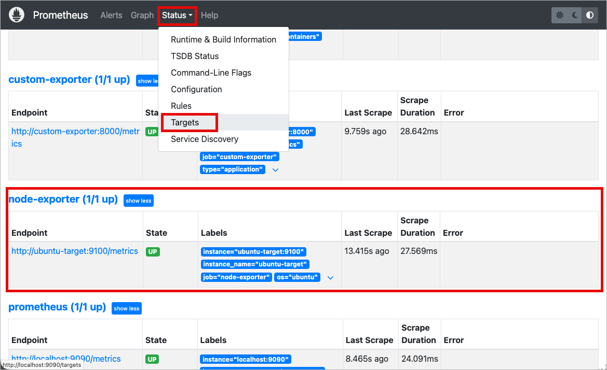

# Step 03: Node Exporter 설치 및 설정

## 📌 이 단계에서 배우는 것
- Node Exporter의 역할과 동작 원리
- Ubuntu 컨테이너에 Node Exporter 설치 방법
- 수집 가능한 시스템 메트릭 카테고리
- 데이터 시뮬레이터로 유동적 데이터 확인
- Prometheus에서 수집 확인

---

## 1. Node Exporter란?

Node Exporter는 **Linux 시스템의 하드웨어 및 OS 메트릭**을 Prometheus 형식으로 노출하는 공식 Exporter입니다.

```
┌─────────────────────────────────────┐
│          Ubuntu Target               │
│                                      │
│  ┌────────────────────────────────┐ │
│  │       Node Exporter            │ │
│  │                                │ │
│  │  CPU ─────┐                    │ │    HTTP GET /metrics
│  │  Memory ──┤                    │ │    ┌──────────────┐
│  │  Disk ────┤── :9100/metrics ───┼──►──│  Prometheus   │
│  │  Network ─┤                    │ │    └──────────────┘
│  │  OS Info ─┘                    │ │
│  └────────────────────────────────┘ │
│                                      │
│  ┌────────────────────────────────┐ │
│  │     Data Simulator             │ │
│  │  (CPU/Memory/Disk 부하 생성)   │ │
│  └────────────────────────────────┘ │
└─────────────────────────────────────┘
```

---

## 2. 설치 방법

### 2.1 학습 환경 (자동 설치)

우리의 Docker 이미지(`docker/ubuntu/Dockerfile`)에서 Node Exporter가 **자동으로 설치**됩니다:

```dockerfile
# Dockerfile에서 Node Exporter 설치 과정
ENV NODE_EXPORTER_VERSION=1.7.0

RUN wget -q "https://github.com/prometheus/node_exporter/releases/download/v${NODE_EXPORTER_VERSION}/node_exporter-${NODE_EXPORTER_VERSION}.linux-amd64.tar.gz" \
    && tar -xzf node_exporter.tar.gz \
    && mv node_exporter /usr/local/bin/ \
    && chmod +x /usr/local/bin/node_exporter
```

### 2.2 실제 서버에 수동 설치하는 방법 (참고)

```bash
# 1. 바이너리 다운로드
VERSION="1.7.0"
wget "https://github.com/prometheus/node_exporter/releases/download/v${VERSION}/node_exporter-${VERSION}.linux-amd64.tar.gz"

# 2. 압축 해제 및 설치
tar -xzf "node_exporter-${VERSION}.linux-amd64.tar.gz"
sudo mv "node_exporter-${VERSION}.linux-amd64/node_exporter" /usr/local/bin/
sudo chmod +x /usr/local/bin/node_exporter

# 3. systemd 서비스 등록
sudo cat > /etc/systemd/system/node_exporter.service << 'EOF'
[Unit]
Description=Node Exporter
After=network.target

[Service]
Type=simple
User=node_exporter
ExecStart=/usr/local/bin/node_exporter
Restart=always

[Install]
WantedBy=multi-user.target
EOF

# 4. 서비스 시작
sudo systemctl daemon-reload
sudo systemctl enable node_exporter
sudo systemctl start node_exporter

# 5. 확인
curl http://localhost:9100/metrics | head
```

---

## 3. 수집 메트릭 카테고리

Node Exporter가 수집하는 주요 메트릭:

### CPU 메트릭

| 메트릭 | 타입 | 설명 |
|--------|------|------|
| `node_cpu_seconds_total` | Counter | CPU 모드별 사용 시간 (초) |
| `node_load1` | Gauge | 1분 평균 부하 |
| `node_load5` | Gauge | 5분 평균 부하 |
| `node_load15` | Gauge | 15분 평균 부하 |

**CPU 모드 (`mode` 레이블):**
- `idle` — 유휴 상태
- `user` — 사용자 프로세스
- `system` — 커널 프로세스
- `iowait` — I/O 대기
- `nice` — 낮은 우선순위 프로세스
- `steal` — 가상화 환경에서 다른 VM에 뺏긴 시간

### 메모리 메트릭

| 메트릭 | 타입 | 설명 |
|--------|------|------|
| `node_memory_MemTotal_bytes` | Gauge | 총 메모리 |
| `node_memory_MemAvailable_bytes` | Gauge | 사용 가능한 메모리 |
| `node_memory_MemFree_bytes` | Gauge | 완전히 빈 메모리 |
| `node_memory_Buffers_bytes` | Gauge | 버퍼 캐시 |
| `node_memory_Cached_bytes` | Gauge | 페이지 캐시 |
| `node_memory_SwapTotal_bytes` | Gauge | 총 스왑 |
| `node_memory_SwapFree_bytes` | Gauge | 사용 가능한 스왑 |

### 디스크 메트릭

| 메트릭 | 타입 | 설명 |
|--------|------|------|
| `node_filesystem_size_bytes` | Gauge | 파일시스템 총 크기 |
| `node_filesystem_avail_bytes` | Gauge | 사용 가능한 공간 |
| `node_filesystem_files` | Gauge | 총 inode 수 |
| `node_disk_read_bytes_total` | Counter | 총 읽기 바이트 |
| `node_disk_written_bytes_total` | Counter | 총 쓰기 바이트 |
| `node_disk_io_time_seconds_total` | Counter | I/O 소요 시간 |

### 네트워크 메트릭

| 메트릭 | 타입 | 설명 |
|--------|------|------|
| `node_network_receive_bytes_total` | Counter | 총 수신 바이트 |
| `node_network_transmit_bytes_total` | Counter | 총 송신 바이트 |
| `node_network_receive_packets_total` | Counter | 총 수신 패킷 |
| `node_network_transmit_packets_total` | Counter | 총 송신 패킷 |
| `node_network_receive_errs_total` | Counter | 수신 에러 수 |

---

## 4. 실습: 메트릭 직접 확인

### 4.1 /metrics 엔드포인트 탐색

```bash
# 전체 메트릭 수 확인
curl -s http://localhost:9100/metrics | grep -v "^#" | wc -l

# HELP/TYPE 주석 확인 (메트릭 설명)
curl -s http://localhost:9100/metrics | grep "^# HELP node_cpu"
# → # HELP node_cpu_seconds_total Seconds the CPUs spent in each mode.

curl -s http://localhost:9100/metrics | grep "^# TYPE node_cpu"
# → # TYPE node_cpu_seconds_total counter

# CPU 메트릭 확인
curl -s http://localhost:9100/metrics | grep "node_cpu_seconds_total"

# 메모리 메트릭 확인
curl -s http://localhost:9100/metrics | grep "node_memory_Mem"

# 디스크 메트릭 확인
curl -s http://localhost:9100/metrics | grep "node_filesystem_size"
```

### 4.2 Prometheus에서 수집 확인

브라우저에서 **http://localhost:9090** 접속 후:

1. `Status > Targets` 에서 `node-exporter` 상태가 **UP**인지 확인



2. Graph 탭에서 아래 쿼리 실행:

```promql
# Node Exporter가 노출하는 메트릭 수
count({job="node-exporter"})

# CPU 모드별 사용 시간
node_cpu_seconds_total{job="node-exporter"}

# 현재 메모리 사용량 (GiB)
(node_memory_MemTotal_bytes - node_memory_MemAvailable_bytes) / 1073741824
```

---

## 5. 데이터 시뮬레이터 동작 확인

### 시뮬레이터 로그 확인

```bash
docker compose -f docker/docker-compose.yml logs -f ubuntu-target
```

출력 예시:
```
[SIMULATOR] Mode: normal, Interval: 30s
[SIMULATOR] ──────────────── Cycle #0 ────────────────
[SIMULATOR] CPU: 2 cores, 35% load for 22s
[SIMULATOR] Memory: allocating 96MB for 22s
[SIMULATOR] ──────────────── Cycle #1 ────────────────
[SIMULATOR] CPU: 1 cores, 18% load for 38s
[SIMULATOR] Memory: allocating 64MB for 38s
[SIMULATOR] Disk I/O: 12MB write for 38s
```

### 시뮬레이터 모드 변경 테스트

```bash
# spike 모드로 변경하여 급격한 부하 패턴 관찰
# docker-compose.yml에서 SIMULATOR_MODE=spike 로 변경 후:
cd docker
docker compose up -d ubuntu-target

# 로그에서 🔥 SPIKE! 메시지 확인
docker compose logs -f ubuntu-target
```

### Prometheus 그래프로 변화 관찰

**http://localhost:9090** 에서 Graph 탭으로 이동:

```promql
# CPU 사용률 변화 추이 (Graph 뷰에서 확인)
100 - (avg(rate(node_cpu_seconds_total{mode="idle",job="node-exporter"}[1m])) * 100)

# 메모리 사용률 변화 추이
(1 - (node_memory_MemAvailable_bytes / node_memory_MemTotal_bytes)) * 100
```

> 💡 시뮬레이터의 의해 메트릭 값이 **실시간으로 변동**하는 것을 그래프에서 확인할 수 있습니다!

---

## 6. 핵심 정리

```
Node Exporter 핵심 포인트:
━━━━━━━━━━━━━━━━━━━━━━━━━━━━━━━━━━━━
✅ HTTP :9100/metrics 엔드포인트에 시스템 메트릭 노출
✅ CPU, 메모리, 디스크, 네트워크 메트릭 자동 수집
✅ Prometheus가 Pull 방식으로 주기적 수집
✅ data-simulator.sh로 유동적인 데이터 변화 생성
✅ 실제 서버에서는 systemd 서비스로 등록하여 운영
```

---

## 다음 단계

👉 [Step 04: PromQL 기초](./04_promql_fundamentals.md) — Prometheus 쿼리 언어를 배웁니다.
