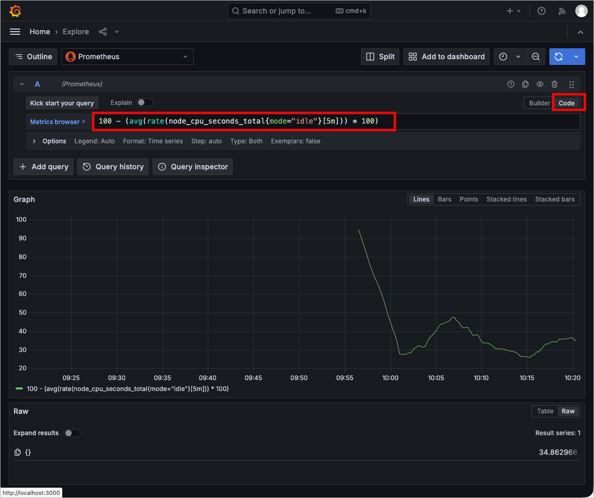
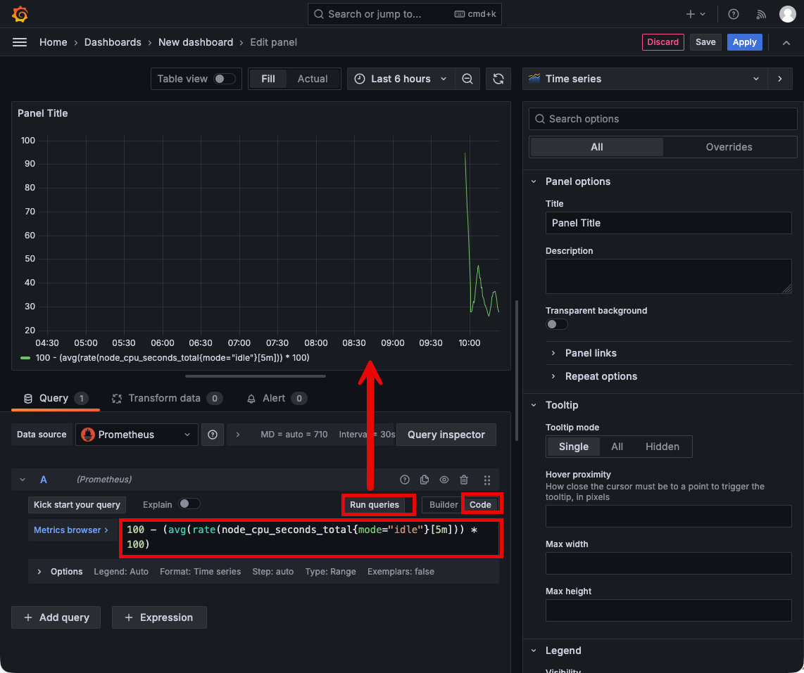

# Step 05: Grafana 기초 및 UI

## 📌 이 단계에서 배우는 것
- Grafana란 무엇인가
- Grafana Web UI 완전 가이드
- Data Source 연결 (Prometheus)
- 첫 번째 패널(Panel) 생성
- 패널 타입 소개

---

## 1. Grafana란?

Grafana는 **오픈소스 데이터 시각화 플랫폼**입니다. Prometheus뿐 아니라 50+개의 데이터 소스를 지원합니다.

| 항목 | 설명 |
|------|------|
| **주요 기능** | 대시보드, 시각화, 알림, 탐색(Explore) |
| **학습 환경 접속** | http://localhost:3000 |
| **기본 계정** | admin / admin123 |

---

## 2. Grafana Web UI 완전 가이드

### 2.1 최초 로그인

1. 브라우저에서 **http://localhost:3000** 접속
2. Username: `admin`, Password: `admin123` 입력
3. (본 학습 환경에서는 비밀번호 변경 화면이 나오면 Skip 가능)

### 2.2 메인 화면 구조

```
┌──────────────────────────────────────────────────────────────┐
│  ☰  ◀ Grafana Logo                         🔔  👤  ⚙️       │
├──────┬───────────────────────────────────────────────────────┤
│      │                                                       │
│  🏠  │              메인 콘텐츠 영역                          │
│ Home │                                                       │
│      │  ┌────────────────────────────────────────────────┐   │
│  📊  │  │                                                │   │
│ Dash │  │          대시보드 또는 선택한 페이지              │   │
│      │  │                                                │   │
│  🔍  │  │                                                │   │
│ Expl │  │                                                │   │
│      │  │                                                │   │
│  🔔  │  └────────────────────────────────────────────────┘   │
│ Aler │                                                       │
│      │                                                       │
│  ⚙️  │                                                       │
│ Conf │                                                       │
│      │                                                       │
└──────┴───────────────────────────────────────────────────────┘
```

### 2.3 사이드바 메뉴

| 아이콘 | 메뉴 | 설명 |
|--------|------|------|
| 🏠 | **Home** | 홈 화면, 최근 대시보드, 즐겨찾기 |
| 📊 | **Dashboards** | 대시보드 목록, 폴더 관리, 가져오기 |
| 🔍 | **Explore** | PromQL 실시간 쿼리 테스트 (매우 유용!) |
| 🔔 | **Alerting** | 알림 규칙, 알림 히스토리, 수신 채널 |
| ⚙️ | **Administration** | 데이터 소스, 플러그인, 사용자/팀 관리 |

### 2.4 Explore (탐색) — 매우 유용!

**Explore** 기능은 PromQL 쿼리를 **대시보드 없이 바로 실행**할 수 있는 도구입니다.

1. 좌측 `🔍 Explore` 클릭
2. 상단에서 Data Source로 `Prometheus` 선택
3. 쿼리 입력 후 `Run query` 클릭

```promql
# Explore에서 실행해 볼 쿼리
100 - (avg(rate(node_cpu_seconds_total{mode="idle"}[5m])) * 100)
```



**Explore의 장점:**
- 대시보드 저장 없이 빠르게 쿼리 테스트
- 자동완성 기능으로 메트릭명/레이블 제안
- 실시간 데이터 그래프 확인
- 쿼리 히스토리 자동 저장

---

## 3. Data Source 연결

### 3.1 자동 프로비저닝 (학습 환경)

이 학습 환경에서는 Prometheus Data Source가 **자동으로 연결**되어 있습니다:

```yaml
# grafana/provisioning/datasources/prometheus.yml
apiVersion: 1
datasources:
  - name: Prometheus
    type: prometheus
    url: http://prometheus:9090
    isDefault: true
```

### 3.2 수동으로 Data Source 추가하는 방법 (참고)

1. `⚙️ Administration` → `Data sources` 클릭
2. `Add data source` 클릭
3. `Prometheus` 선택
4. URL: `http://prometheus:9090` 입력
5. `Save & Test` 클릭
6. ✅ "Successfully queried the Prometheus API" 확인

---

## 4. 첫 번째 패널 생성 (단계별)

### Step 1: 빈 대시보드 생성

1. `📊 Dashboards` → `New` → `New Dashboard` 클릭
2. `Add visualization` 클릭

### Step 2: Data Source 선택

1. Data source 드롭다운에서 `Prometheus` 선택

### Step 3: 쿼리 입력

```promql
100 - (avg(rate(node_cpu_seconds_total{mode="idle"}[5m])) * 100)
```



### Step 4: 패널 설정

1. **Title**: `CPU 사용률 (%)` 입력
2. **Panel Type**: 우측 상단에서 패널 타입 선택 (Time series, Gauge 등)
3. **Unit**: 우측 패널 옵션에서 `Standard options > Unit > Misc > Percent (0-100)` 선택

### Step 5: 저장

1. 우측 상단 `Apply` 클릭 → 패널이 대시보드에 추가됨
2. 우측 상단 💾 (Save) 클릭
3. 대시보드 이름 입력 → `Save`

---

## 5. 패널 타입 소개

| 패널 타입 | 용도 | 적합한 데이터 |
|-----------|------|-------------|
| **Time series** | 시간에 따른 변화 추이 | CPU, 메모리, 트래픽 추이 |
| **Gauge** | 현재 값의 비율 표시 | CPU 사용률, 디스크 사용률 |
| **Stat** | 단일 큰 숫자 표시 | 업타임, 총 요청 수, 활성 사용자 |
| **Bar chart** | 카테고리별 비교 | 엔드포인트별 요청 수 |
| **Table** | 데이터를 테이블로 표시 | 인스턴스 목록, 상세 메트릭 |
| **Heatmap** | 값의 분포를 색상으로 표시 | 응답 시간 분포 |
| **Pie chart** | 비율 시각화 | 트래픽 비율, 에러 코드 분포 |
| **Bar gauge** | 가로 막대 게이지 | 리소스 사용률 비교 |

### 각 패널에 적합한 PromQL 예시

```promql
# Time Series — CPU 사용률 추이
100 - (avg(rate(node_cpu_seconds_total{mode="idle"}[5m])) * 100)

# Gauge — 현재 메모리 사용률
(1 - (node_memory_MemAvailable_bytes / node_memory_MemTotal_bytes)) * 100

# Stat — 시스템 업타임
time() - node_boot_time_seconds

# Bar chart — 엔드포인트별 요청 속도
sum by(endpoint) (rate(app_requests_total[5m]))

# Table — 모든 타깃 상태
up
```

---

## 6. 시간 범위 및 새로고침

### 시간 범위 선택

대시보드 우측 상단의 시계 아이콘을 클릭:
- `Last 5 minutes` — 최근 5분
- `Last 1 hour` — 최근 1시간 (기본값)
- `Last 6 hours` — 최근 6시간
- `Last 24 hours` — 최근 하루
- `Custom range` — 원하는 범위 직접 지정

### 자동 새로고침

우측 상단의 새로고침 드롭다운:
- `5s`, `10s`, `30s`, `1m`, `5m` 등 선택 가능
- 대시보드가 자동으로 최신 데이터를 갱신합니다

---

## 7. 프로비저닝된 대시보드 확인

학습 환경에는 2개의 대시보드가 **자동으로 프로비저닝**되어 있습니다:

1. `📊 Dashboards` → `Learning Lab` 폴더 클릭
2. 두 개의 대시보드 확인:
   - **Node Overview** — 시스템 모니터링 (CPU, 메모리, 디스크, 네트워크)
   - **Custom Metrics** — 애플리케이션 모니터링 (요청, 에러, 사용자)

> 💡 이 대시보드들의 패널을 클릭하여 PromQL 쿼리와 설정을 학습할 수 있습니다!

---

## 핵심 정리

```
Grafana 핵심 포인트:
━━━━━━━━━━━━━━━━━━━━━━━━━━━━━━━━━━
✅ http://localhost:3000 (admin / admin123)
✅ Explore — 쿼리 테스트에 가장 유용
✅ Data Source로 Prometheus 연결
✅ Panel Type에 따라 다른 시각화
✅ 시간 범위와 자동 새로고침 활용
✅ 프로비저닝된 대시보드로 학습 가능
```

---

## 다음 단계

👉 [Step 06: Grafana 대시보드 구성](./06_grafana_dashboards.md) — 실전 대시보드를 직접 만들어 봅니다.
