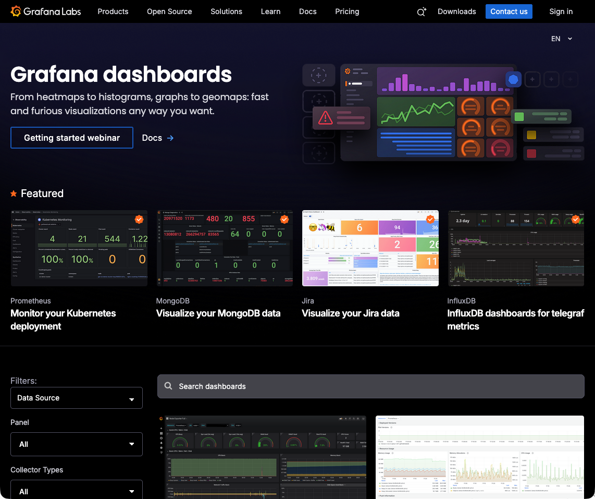
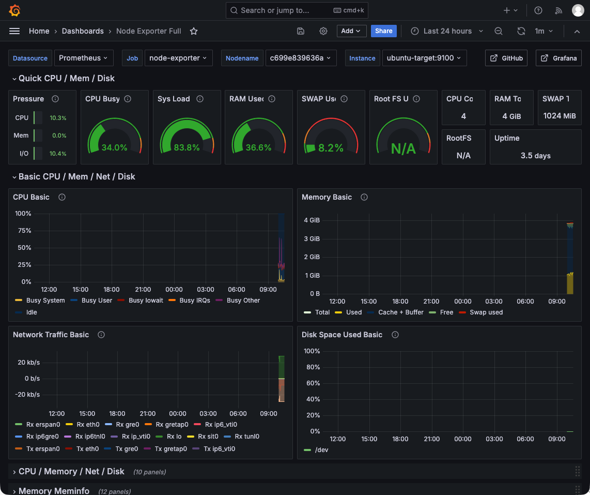

# Step 06: Grafana 대시보드 구성 (실전)

## 📌 이 단계에서 배우는 것
- 대시보드 구조 (Row, Panel)
- 시스템 모니터링 대시보드 직접 구성
- 패널 편집 심화 (단위, 색상 임계값, 오버라이드)
- 대시보드 내보내기/가져오기 (JSON)
- 커뮤니티 대시보드 활용

---

## 1. 대시보드 구조

```
┌─ Dashboard ──────────────────────────────────────────────┐
│                                                           │
│  ┌─ Row: 시스템 개요 ──────────────────────────────────┐ │
│  │  ┌──────────┐ ┌──────────┐ ┌──────────┐ ┌────────┐ │ │
│  │  │  Gauge   │ │  Gauge   │ │  Gauge   │ │  Stat  │ │ │
│  │  │  CPU %   │ │  Mem %   │ │  Disk %  │ │ Uptime │ │ │
│  │  └──────────┘ └──────────┘ └──────────┘ └────────┘ │ │
│  └─────────────────────────────────────────────────────┘ │
│                                                           │
│  ┌─ Row: CPU 상세 ─────────────────────────────────────┐ │
│  │  ┌────────────────────┐ ┌────────────────────┐      │ │
│  │  │    Time Series     │ │    Time Series     │      │ │
│  │  │   CPU 사용률 추이   │ │ CPU 모드별 사용률    │      │ │
│  │  └────────────────────┘ └────────────────────┘      │ │
│  └─────────────────────────────────────────────────────┘ │
│                                                           │
│  ┌─ Row: 메모리 ───────────────────────────────────────┐ │
│  │  ┌────────────────────┐ ┌────────────────────┐      │ │
│  │  │   메모리 사용량      │ │   메모리 구성        │      │ │
│  │  └────────────────────┘ └────────────────────┘      │ │
│  └─────────────────────────────────────────────────────┘ │
└──────────────────────────────────────────────────────────┘
```

---

## 2. 실전: 시스템 모니터링 대시보드 구성

### 2.1 새 대시보드 생성

1. `📊 Dashboards` → `New` → `New Dashboard`
2. ⚙️ (Dashboard settings) 클릭
3. **Name**: `내 시스템 모니터링`
4. **Tags**: `learning`, `system`
5. `Save dashboard` 클릭

### 2.2 Row 추가

1. `Add` → `Add row` 클릭
2. Row 제목을 `🖥️ 시스템 개요`로 변경

### 2.3 패널 추가 (CPU Gauge)

1. `Add` → `Add visualization`
2. Data source: `Prometheus`
3. 쿼리 입력:

```promql
100 - (avg(rate(node_cpu_seconds_total{mode="idle",job="node-exporter"}[5m])) * 100)
```

4. **패널 설정:**
   - Type: `Gauge`
   - Title: `CPU 사용률`
   - Unit: `Percent (0-100)`
   - Min: `0`, Max: `100`
   - Thresholds:
     - Green (base)
     - Yellow: 50
     - Orange: 75
     - Red: 90

5. `Apply` 클릭

### 2.4 패널 추가 (Memory Gauge)

쿼리:
```promql
(1 - (node_memory_MemAvailable_bytes{job="node-exporter"} / node_memory_MemTotal_bytes{job="node-exporter"})) * 100
```

### 2.5 패널 추가 (CPU 추이 Time Series)

쿼리:
```promql
100 - (avg(rate(node_cpu_seconds_total{mode="idle",job="node-exporter"}[5m])) * 100)
```

패널 설정:
- Type: `Time series`
- Line width: `2`
- Fill opacity: `20`
- Gradient mode: `Scheme`
- Show points: `Never`

---

## 3. 패널 편집 심화

### 3.1 단위 설정 (Unit)

| 카테고리 | 단위 | 용도 |
|----------|------|------|
| Misc | `Percent (0-100)` | CPU%, 메모리% |
| Data | `bytes(IEC)` | 메모리, 디스크 크기 |
| Data rate | `bytes/sec(IEC)` | 네트워크 속도 |
| Time | `seconds` | 업타임, 응답 시간 |
| Throughput | `requests/sec` | 요청 처리 속도 |

### 3.2 Thresholds (색상 임계값)

패널의 색상이 값에 따라 자동으로 변경됩니다:

```
Green  (기본) → 0~49%    정상
Yellow        → 50~74%   주의
Orange        → 75~89%   경고
Red           → 90~100%  위험
```

### 3.3 Override (오버라이드)

같은 패널에서 특정 시리즈만 다른 스타일을 적용할 때 사용합니다:

1. Panel 편집 → `Overrides` 탭
2. `Add field override` 클릭
3. `Fields with name` → 시리즈 이름 선택
4. 적용할 속성 선택 (색상, 스타일, 단위 등)

예시: 네트워크 Transmit을 음수 Y축으로 표시
1. Override → `Fields with name matching regex` → `.*Transmit.*`
2. `Custom > Transform` → `Negative Y`

---

## 4. 대시보드 JSON 내보내기/가져오기

### 4.1 내보내기 (Export)

1. 대시보드 상단 ⚙️ (Settings) 클릭
2. `JSON Model` 탭에서 JSON 내용 확인
3. 또는 `Share` → `Export` → `Save to file` 클릭

### 4.2 가져오기 (Import)

1. `📊 Dashboards` → `New` → `Import`
2. JSON 파일 업로드 또는 대시보드 ID 입력
3. Data source 매핑 → `Import`

### 4.3 커뮤니티 대시보드 활용

[Grafana Labs 대시보드](https://grafana.com/grafana/dashboards/)에서 수천 개의 무료 대시보드를 가져올 수 있습니다.



**추천 대시보드:**

| ID | 이름 | 설명 |
|----|------|------|
| **1860** | Node Exporter Full | Node Exporter 종합 대시보드 |
| **3662** | Prometheus 2.0 Overview | Prometheus 자체 모니터링 |
| **14282** | cAdvisor Exporter | Docker 컨테이너 모니터링 |
| **11600** | Docker Container & Host Metrics | 호스트+컨테이너 통합 |

**가져오기 실습:**

1. `📊 Dashboards` → `New` → `Import`
2. `Import via grafana.com` 입력란에 `1860` 입력
3. `Load` 클릭
4. Prometheus data source 선택
5. `Import` 클릭



> 💡 커뮤니티 대시보드를 가져와서 PromQL 쿼리와 패널 구성 방법을 학습할 수 있습니다!

---

## 5. 유용한 패널 레시피

### 네트워크 트래픽 (송수신 대칭 그래프)

수신(Receive)은 양수, 송신(Transmit)은 음수로 표시하여 대칭 그래프를 만듭니다:

```promql
# Query A - Receive (양수)
rate(node_network_receive_bytes_total{device!="lo"}[5m])

# Query B - Transmit (음수)
-rate(node_network_transmit_bytes_total{device!="lo"}[5m])
```

### 디스크 I/O 속도

```promql
# Read (bytes/s)
rate(node_disk_read_bytes_total[5m])

# Write (bytes/s)
rate(node_disk_written_bytes_total[5m])
```

### Top N 패널 (가장 활발한 엔드포인트)

```promql
topk(5, sum by(endpoint) (rate(app_requests_total[5m])))
```

---

## 핵심 정리

| 기능 | 설명 |
|------|------|
| **Row** | 패널 그룹화, 접기/펼치기 가능 |
| **Thresholds** | 값에 따른 자동 색상 변경 |
| **Override** | 특정 시리즈에 다른 스타일 적용 |
| **JSON Export/Import** | 대시보드를 코드로 관리 가능 |
| **커뮤니티 대시보드** | ID로 수천 개의 무료 대시보드 가져오기 |

---

## 다음 단계

👉 [Step 07: PromQL 고급 쿼리](./07_promql_advanced.md) — 고급 함수와 실전 시나리오를 학습합니다.
